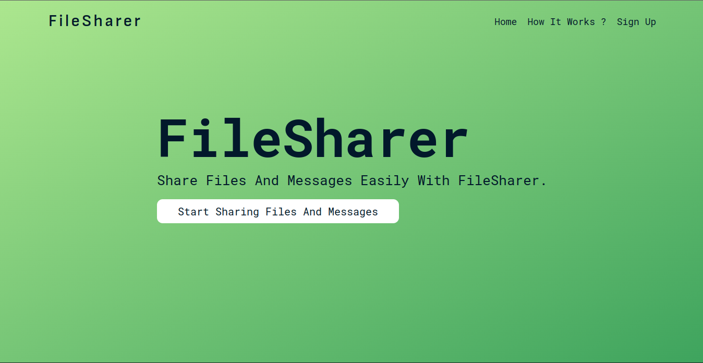
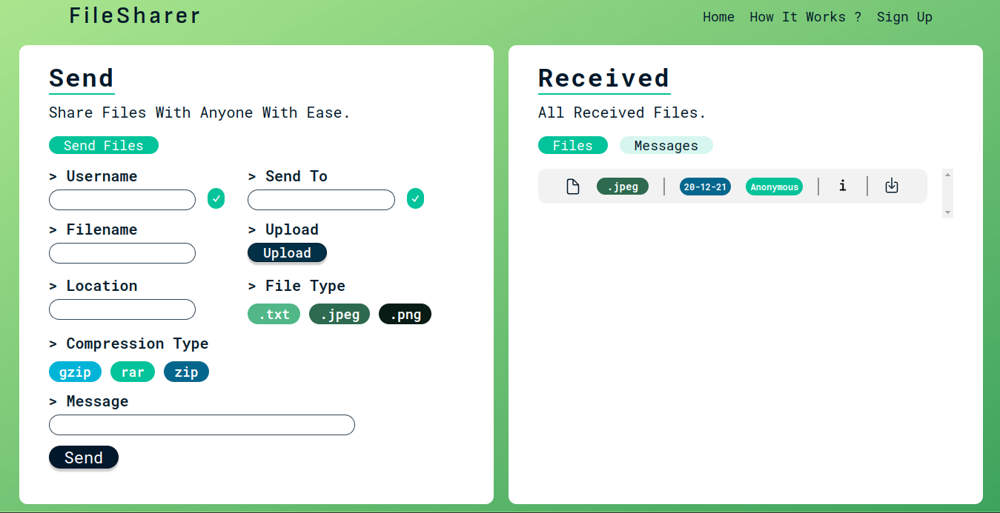
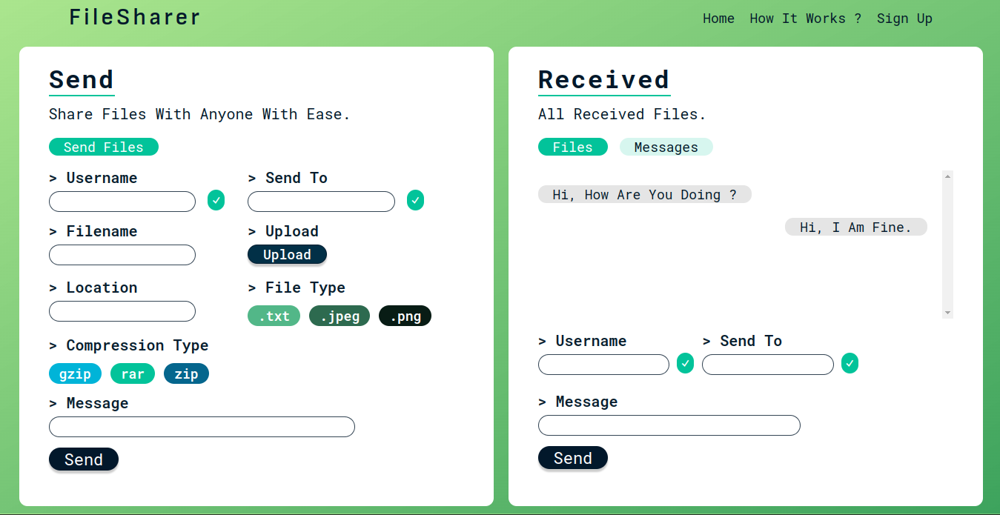
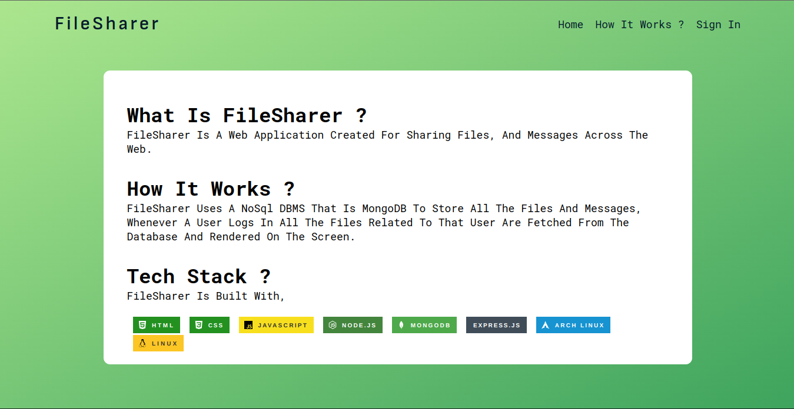

# FileShare

FileSharer is a web application (Created as mini DBMS project for college), through which anyone can share files and messages.

## Web application

Home Page,

Received Files,

Received Messages,

How It Works ? Page,

